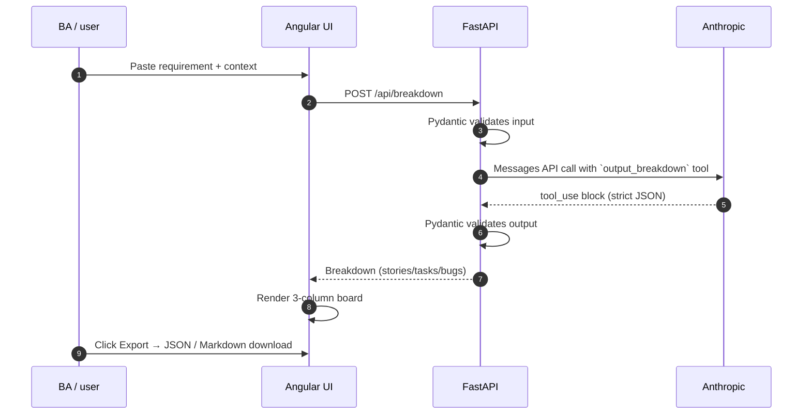

# Requirements Planner

An SDLC-helper platform that turns a Business Analyst's free-form requirement document into a structured backlog — **Stories, Tasks, and likely Bugs** — that devs, QAs, and the rest of the team can pick up directly.

Paste a requirement → AI breaks it down → review on a clean 3-column board → export to JSON or Markdown.

---

## Table of contents

- [What it does](#what-it-does)
- [Tech stack](#tech-stack)
- [Architecture](#architecture)
- [Workflow](#workflow)
- [Project structure](#project-structure)
- [Prerequisites](#prerequisites)
- [Quick start (Docker)](#quick-start-docker)
- [Local development (no Docker)](#local-development-no-docker)
- [Configuration](#configuration)
- [API reference](#api-reference)
- [Output schema](#output-schema)
- [Troubleshooting](#troubleshooting)
- [Design notes](#design-notes)

---

## What it does

- Takes a BA requirement document (free text + optional context like tech stack).
- Sends it to **Anthropic Claude** via the Messages API with **tool-use** forced output, so the model emits strict structured JSON — never hand-parsed prose.
- Returns:
  - a one-paragraph **summary** of what's being built,
  - a list of **Stories** with acceptance criteria + story points,
  - **Tasks** broken down with `assignee_type` (dev / qa / design / devops), estimates, and links to parent stories,
  - **Likely Bugs** — proactive list of edge cases & risk areas with severity and repro steps.
- Renders the result in an Angular Material 3-column board.
- One-click export to **JSON** or **Markdown**.

It's intentionally MVP — no login, no database, no Jira push. Each session is self-contained.

---

## Tech stack

| Layer | Tech |
|---|---|
| LLM | Anthropic Claude (Messages API, tool-use) |
| Backend | Python 3.12, FastAPI, Uvicorn, httpx (async) |
| Schemas | Pydantic v2 |
| Frontend | Angular 17 (standalone components, control-flow syntax) |
| UI library | Angular Material 17 |
| Frontend HTTP | `HttpClient` |
| Container | Docker + Docker Compose, two-stage Node→nginx for frontend |
| Reverse proxy | nginx (frontend container also proxies `/api/*` to backend) |

---

## Architecture

```
+----------------------+         +-------------------------+         +------------------------+
|   Browser            |  HTTP   |   frontend container    |  HTTP   |   backend container    |
|   (you / your team)  | <-----> |   nginx :80             | <-----> |   FastAPI :8000        |
|   localhost:4200     |         |   serves Angular SPA    |         |                        |
|                      |         |   + proxies /api → bk   |         |                        |
+----------------------+         +-------------------------+         +------------------------+
                                                                                |
                                                                                | HTTPS (tool-use)
                                                                                v
                                                                api.anthropic.com/v1/messages
```

The browser only talks to the frontend container. nginx forwards `/api/*` to the backend container over the internal Docker network — no CORS gymnastics in production.

---

## Workflow



Why tool-use instead of "ask for JSON in the prompt": Claude returns the exact JSON shape we declare in the tool's `input_schema`. No regex parsing, no string-to-JSON salvage when the model forgets a closing brace.

---

## Project structure

```
project2-requirements-planner/
├── backend/
│   ├── main.py                  # FastAPI app + /api/breakdown
│   ├── anthropic_client.py      # Async client + tool-use JSON schema
│   ├── schemas.py               # Pydantic models (Story, Task, Bug, Breakdown)
│   ├── requirements.txt
│   ├── Dockerfile
│   └── .dockerignore
├── frontend/
│   ├── src/
│   │   ├── index.html
│   │   ├── main.ts
│   │   ├── styles.scss
│   │   └── app/
│   │       ├── app.component.ts/html/scss
│   │       ├── app.config.ts
│   │       ├── models/work-item.model.ts
│   │       ├── services/
│   │       │   ├── breakdown.service.ts    # HTTP client → /api/breakdown
│   │       │   └── export.service.ts       # JSON & Markdown export
│   │       └── components/
│   │           ├── requirements-form/      # Input form
│   │           ├── work-item-board/        # 3-column board
│   │           └── work-item-card/         # Story / Task / Bug card
│   ├── angular.json / tsconfig*.json / package.json
│   ├── proxy.conf.json          # ng serve → backend in dev
│   ├── nginx.conf               # production proxy
│   ├── Dockerfile               # Node builder → nginx serve
│   └── .dockerignore
├── docker-compose.yml
├── .env.example
├── .gitignore
└── README.md
```

---

## Prerequisites

- **Docker Desktop** running.
- An **Anthropic API key** ([console.anthropic.com](https://console.anthropic.com) → Settings → API Keys).

For non-Docker dev: Python 3.10+ and Node.js 20+.

---

## Quick start (Docker)

```bash
cd ~/Downloads/project2-requirements-planner

# 1. Set up your env
cp .env.example .env
# Edit .env and put your real ANTHROPIC_API_KEY in

# 2. Build and run both services
docker compose up --build
```

Open the UI at **http://localhost:4200**.

Other useful endpoints (debugging):
- Backend health: http://localhost:8000/health
- Interactive API docs: http://localhost:8000/docs

To stop:

```bash
docker compose down
```

---

## Local development (no Docker)

**Terminal 1 — backend**

```bash
cd backend
python3 -m pip install -r requirements.txt
export ANTHROPIC_API_KEY=sk-ant-...
uvicorn main:app --reload --port 8000
```

**Terminal 2 — frontend**

```bash
cd frontend
npm install --legacy-peer-deps
npm start -- --proxy-config proxy.conf.json
```

The dev server runs on http://localhost:4200 and proxies `/api/*` to `http://localhost:8000` via `proxy.conf.json`.

---

## Configuration

### Backend (`.env`)

| Variable | Required | Default | Notes |
|---|---|---|---|
| `ANTHROPIC_API_KEY` | yes | — | Backend fails to start without it. |
| `ANTHROPIC_DEFAULT_MODEL` | no | `claude-sonnet-4-5` | Try `claude-haiku-4-5` for cheaper/faster generation. |

### Frontend

No env config needed. The Angular app calls `/api/*` which nginx (in Docker) or `proxy.conf.json` (in dev) routes to the backend.

---

## API reference

### `GET /health`

```json
{"status": "ok", "service": "requirements-planner"}
```

### `POST /api/breakdown`

**Request**

```json
{
  "project_name": "Customer Onboarding Wizard",
  "requirements": "We need a guided onboarding flow ...",
  "extra_context": "Stack: React + Node + Postgres. Existing auth: Auth0."
}
```

`requirements` must be at least 20 characters. `extra_context` is optional.

**Response** — full `Breakdown` (see [Output schema](#output-schema)).

**Try it with curl**

```bash
curl -X POST http://localhost:8000/api/breakdown \
  -H "Content-Type: application/json" \
  -d '{
    "project_name": "Test",
    "requirements": "Build a simple to-do list app where users can add, edit, and delete tasks, and mark them complete. Mobile-friendly."
  }' | jq
```

---

## Output schema

### Breakdown

| Field | Type | Notes |
|---|---|---|
| `project_name` | string | echoes the input |
| `summary` | string | one-paragraph plain-English summary |
| `stories` | Story[] | usually 3–8 |
| `tasks` | Task[] | concrete engineering / QA / design / devops work |
| `bugs` | Bug[] | proactive list of likely defects / edge cases |

### Story

| Field | Type | Notes |
|---|---|---|
| `id` | string | `STORY-1`, `STORY-2`, … |
| `title` | string | short headline |
| `description` | string | usually in "As a / I want / so that" form |
| `acceptance_criteria` | string[] | 2–5 concrete bullets |
| `story_points` | int | one of 1, 2, 3, 5, 8, 13, 21 |

### Task

| Field | Type | Notes |
|---|---|---|
| `id` | string | `TASK-1`, … |
| `title` / `description` | string | |
| `assignee_type` | `"dev" \| "qa" \| "design" \| "devops"` | |
| `parent_story_id` | string \| null | link back to a Story |
| `estimate_hours` | number | |

### Bug

| Field | Type | Notes |
|---|---|---|
| `id` | string | `BUG-1`, … |
| `title` / `description` | string | |
| `severity` | `"low" \| "medium" \| "high" \| "critical"` | |
| `steps_to_reproduce` | string[] | |
| `expected_behavior` / `actual_behavior` | string | |

---

## Troubleshooting

**`ANTHROPIC_API_KEY must be set` on backend boot.** Create `.env` from `.env.example` and put a real key in it. `docker compose down && docker compose up --build`.

**`Anthropic API error 401`.** Key is wrong or revoked. Replace in `.env` and restart.

**`Anthropic API error 404 ... model: ...`.** The model id isn't enabled on your account. Switch `ANTHROPIC_DEFAULT_MODEL` to `claude-haiku-4-5` or another model your console shows.

**`Anthropic did not return a tool_use block`.** Very rare; usually a transient API issue. Retry. If persistent, the prompt may need tweaking — open `backend/anthropic_client.py` → `_SYSTEM_PROMPT`.

**Frontend builds but the API call returns 404.** Either you're hitting the backend directly without the `/api` prefix, or nginx isn't proxying. Check `frontend/nginx.conf` and that the backend container is named `backend` in `docker-compose.yml`.

**Port conflict (4200 or 8000 already in use).** Edit the host-side port in `docker-compose.yml`, e.g. `"5200:80"` for the frontend.

---

## Design notes

- **Tool-use for structured output.** The `output_breakdown` JSON schema is sent to Claude as a tool definition; `tool_choice` forces it. We never parse free-form text — the model returns the exact shape we then validate with Pydantic.
- **Async end-to-end on the backend.** `httpx.AsyncClient` with a process-shared instance + keep-alive. Lifespan hook closes it on shutdown.
- **Strict Pydantic validation on both sides.** Input is validated before the API call; output is re-validated when it comes back from Anthropic, so any schema drift fails loud instead of crashing the UI.
- **Angular 17 standalone components.** No NgModules. Uses the new `@if` / `@for` template control flow.
- **Material 3 theme.** `azure-blue` prebuilt theme from `@angular/material` for a clean modern look out of the box.
- **No persistence by design (v1).** Each browser session is independent. Add SQLite + a `requirements` table to persist breakdowns when the team needs history.
- **No browser CORS.** The browser only talks to the frontend container; nginx forwards `/api/*` server-side to the backend.
- **Export keeps the data portable.** JSON gives you the raw shape; Markdown is human-readable and pastes cleanly into Jira / Confluence / docs.
